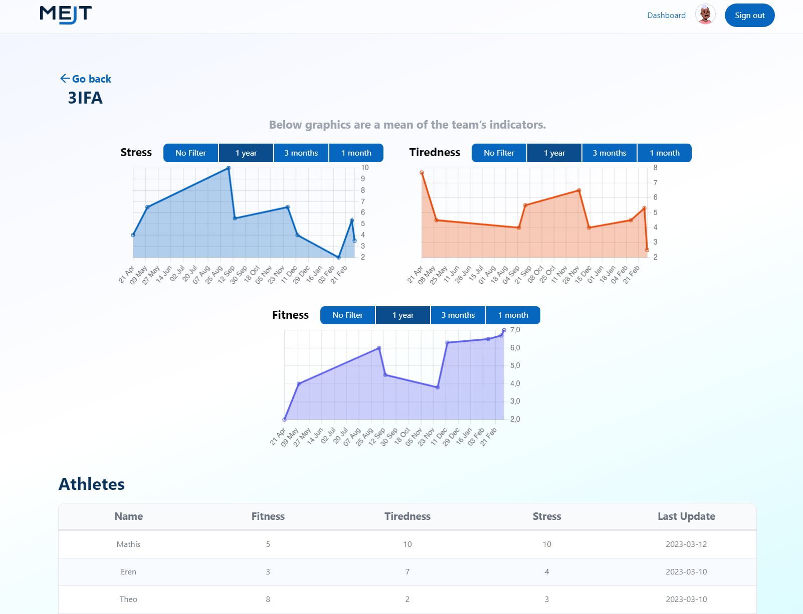
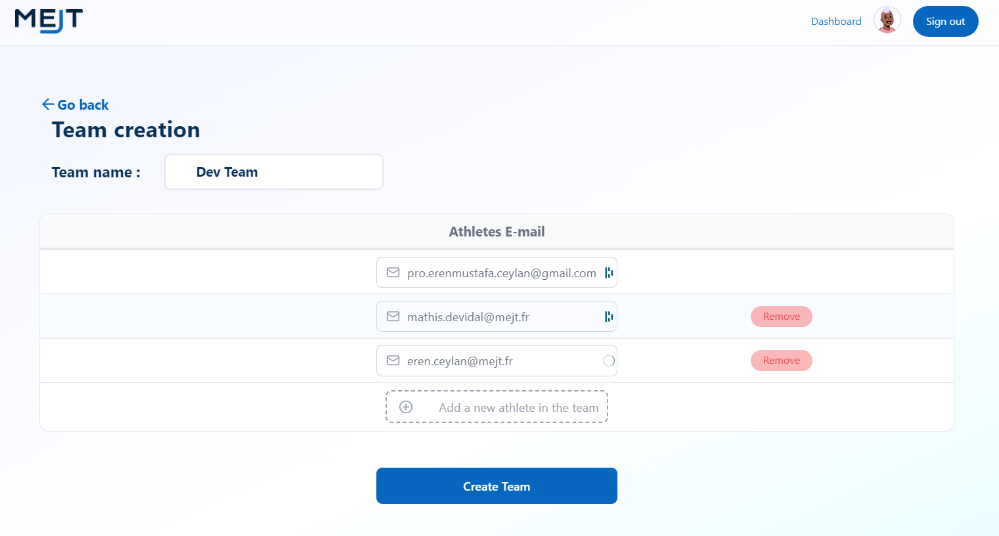
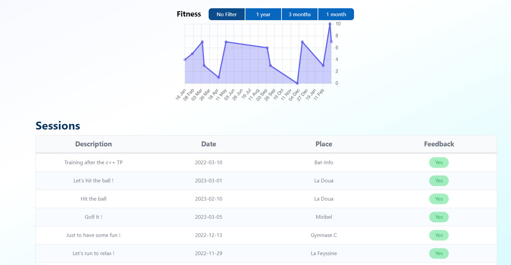
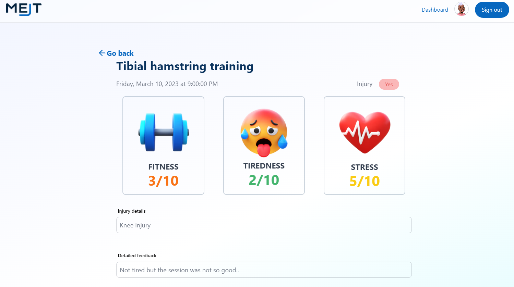

# MEJT

## Introduction

MEJT is a training app. It allows you to create and manage your training sessions. You can also share your training sessions with your friends.

## Back-end / API

- [MEJT-API](https://github.com/ErenMustafaGit/MEJT-API)
- Supabase Database (POSTGRESQL)

## Demo creditendials

### Trainer

- email: trainer@mejt.fr
- password: MEJT1MEJT

### Athlete

- email: athlete@mejt.fr
- password: MEJT1MEJT

## **📷 Galerie**

<table>
    <thead>
        <tr>
            <th>Home</th>
            <th>Register</th>
        </tr>
    </thead>
    <tbody>
        <tr>
            <td></td>
            <td></td>
        </tr>
    </tbody>
     <thead>
        <tr>
            <th>Trainer Dashboard</th>
            <th>Team creation (Trainer)</th>
        </tr>
    </thead>
    <tbody>
        <tr>
            <td></td>
            <td></td>
        </tr>
    </tbody>
    <thead>
        <tr>
            <th>Athlete dashboard</th>
            <th>Feedback detail</th>
        </tr>
    </thead>
    <tbody>
        <tr>
            <td></td>
            <td></td>
        </tr>
    </tbody>
</table>

## Tech Stack + Features

### Frameworks

- [Next.js](https://nextjs.org/) – React framework for building performant apps with the best developer experience
- [Auth.js](https://authjs.dev/) – Handle user authentication with ease with providers like Google, Twitter, GitHub, etc.

### Platforms

- [Vercel](https://vercel.com/) – Easily preview & deploy changes with git
- [Railway](https://railway.app/) – Easily provision a PostgreSQL database (no login required)

### UI

- [Tailwind CSS](https://tailwindcss.com/) – Utility-first CSS framework for rapid UI development
- [Radix](https://www.radix-ui.com/) – Primitives like modal, popover, etc. to build a stellar user experience
- [Framer Motion](https://framer.com/motion) – Motion library for React to animate components with ease
- [Lucide](https://lucide.dev/) – Beautifully simple, pixel-perfect icons
- [`@next/font`](https://nextjs.org/docs/basic-features/font-optimization) – Optimize custom fonts and remove external network requests for improved performance
- [`@vercel/og`](https://vercel.com/docs/concepts/functions/edge-functions/og-image-generation) – Generate dynamic Open Graph images on the edge
- [`react-wrap-balancer`](https://github.com/shuding/react-wrap-balancer) – Simple React component that makes titles more readable
- [`react-loading-skeleton`](https://www.npmjs.com/package/react-loading-skeleton) - Make beautiful, animated loading skeletons that automatically adapt to your app

### Hooks and Utilities

- `useIntersectionObserver` –  React hook to observe when an element enters or leaves the viewport
- `useLocalStorage` – Persist data in the browser's local storage
- `useScroll` – React hook to observe scroll position ([example](https://github.com/steven-tey/precedent/blob/main/components/layout/index.tsx#L25))
- `nFormatter` – Format numbers with suffixes like `1.2k` or `1.2M`
- `capitalize` – Capitalize the first letter of a string
- `truncate` – Truncate a string to a specified length
- [`use-debounce`](https://www.npmjs.com/package/use-debounce) – Debounce a function call / state update
- [`cookies`](https://github.com/andreizanik/cookies-next) – Simple cookie management for Next.js

### Code Quality

- [TypeScript](https://www.typescriptlang.org/) – Static type checker for end-to-end typesafety
- [Prettier](https://prettier.io/) – Opinionated code formatter for consistent code style
- [ESLint](https://eslint.org/) – Pluggable linter for Next.js and TypeScript

### Miscellaneous

- [Vercel Analytics](https://vercel.com/analytics) – Track unique visitors, pageviews, and more in a privacy-friendly way

## Author

- Mathis DEVIDAL
- Eren Mustafa CEYLAN
- Theo HAURAY
- Justin CUZIN
